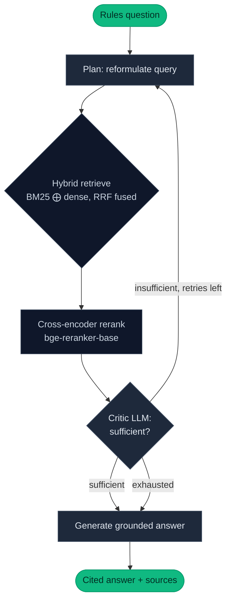

# boardgames-rag


[](https://huggingface.co/spaces/Malvenoak/boardgames-rag)

Agentic Retrieval-Augmented Generation over board game rulebooks — ask a
natural-language rules question, get a grounded, cited answer with the
agent's reasoning shown live.

**[Try the live demo →](https://huggingface.co/spaces/Malvenoak/boardgames-rag)**


**Runs fully local at $0 in dev.** The RAG pipeline uses local LLM inference
(Ollama) and local embeddings (sentence-transformers) — no API keys, no paid
services. The deployed Space uses Groq's free-tier `llama-3.3-70b-versatile`
because HuggingFace's free CPU tier can't run Ollama at usable speed.

The corpus is ten games spanning family weight to heavy strategy — Catan,
Ticket to Ride, Carcassonne, Azul, 7 Wonders, Wingspan, Scythe, Terraforming
Mars, Brass: Birmingham — plus the *Magic: The Gathering Comprehensive Rules*
as a deeply-numbered plain-text document.

---

## Vision — 7-week scope

| Week | Status | Deliverable |
|------|--------|-------------|
| 1 | ✅ Done | Project scaffold, Qdrant via docker-compose, ingestion pipeline (PDF + plain-text), chunker tests. |
| 2 | ✅ Done | Hybrid retrieval — BM25 + dense, fused with Reciprocal Rank Fusion. |
| 3 | ✅ Done | Local cross-encoder reranking (`bge-reranker-base`); grounded answer generation (Ollama). |
| 4 | ✅ Done | Ragas evaluation — faithfulness, answer relevancy, context precision & recall; rerank on/off ablation. |
| 5 | ✅ Done | Agentic loop in LangGraph — planner / retriever / critic, with reformulated-query retry. |
| 6 | ✅ Done | FastAPI service: `/ask`, SSE-streaming `/ask/stream`, static frontend, `/eval` dashboard. |
| 7 | ✅ Done | Deployed on HuggingFace Spaces (free tier) — agent LLM switched to Groq for hosted inference. |

## Status — all weeks complete

The pipeline runs end-to-end as both a **linear** RAG path and an
**agentic** path that share retrieval and generation code, exposed
through a polished web UI and a FastAPI service:

- **Ingest** — parses PDFs (`pymupdf4llm`) and plain-text rules, chunks them
  with heading-aware ~512-token windows + 50-token overlap, embeds with
  `BAAI/bge-small-en-v1.5`, and stores them in Qdrant with stable
  content-hash IDs. A parallel BM25 index is built for lexical search.
- **Retrieve** — hybrid search: BM25 (lexical) + dense (semantic) candidates
  fused via Reciprocal Rank Fusion, with a consistency check between the two
  indexes.
- **Generate** — retrieve → cross-encoder rerank → strict-grounded answer
  from a local Ollama model, with citations. Refuses rather than hallucinate
  when the rulebooks don't cover the question.
- **Agent** — a LangGraph state machine: plan → retrieve → critique →
  (sufficient ⇒ generate, otherwise loop with a reformulated query, bounded
  by a max-attempts cap). Same retrieval + generation primitives as the
  linear path, with an LLM critic gating the loop.
- **Evaluate** — runs either pipeline over a curated 30-question test set
  and scores with Ragas; ablations supported (rerank on/off, agent vs
  linear). The pipeline LLM is config-pluggable between local Ollama and
  Groq via `--llm-provider`.
- **Service** — FastAPI with `POST /ask` (synchronous) and `POST /ask/stream`
  (SSE; emits `plan` / `retrieve` / `critique` / `token` / `sources` / `done`
  events for live agent-trace visualization).
- **Web UI** — single-page app at `/`: pick a rulebook, pick a sample
  question chip or type your own, watch the agent reason and cite as it
  works. A side-by-side **linear-vs-agent comparison** mode runs both
  pipelines on the same question. A separate `/eval.html` dashboard renders
  the measured experiments as Chart.js bar charts.
- **Deploy** — single-container Docker image on HuggingFace Spaces, with
  Qdrant in embedded on-disk mode and the agent LLM flipped to Groq.

Current corpus: **10 rulebooks → 1,014 indexed chunks**. Test suite: **241
tests passing** (ruff lint + format clean).

## Architecture



The **linear pipeline** runs the same retrieve → rerank → generate spine
without the planner / critic loop — useful as a baseline and exposed
through the comparison view.

## Try it

- **Live demo:** [huggingface.co/spaces/Malvenoak/boardgames-rag](https://huggingface.co/spaces/Malvenoak/boardgames-rag)
- **Evaluation dashboard:** the live `/eval.html` page renders the three
  measured experiments below as Chart.js bar charts with per-metric delta
  tables.
- **OpenAPI playground:** `/docs` exposes every endpoint with
  request/response schemas — runnable from the page.

## Evaluation results

Three measured experiments, all judged by `gemini-2.5-flash` against the
same 30-question test set (3 per game), 100% score coverage. Live charts
of the same data are at `/eval.html` on the deployed Space.

### Week 4 — does the cross-encoder reranker earn its cost?

| Metric | rerank-on | rerank-off | Δ (on − off) |
|--------|-----------|------------|--------------|
| Faithfulness | 0.94 | 0.85 | **+0.10** |
| Answer relevancy | 0.76 | 0.68 | **+0.08** |
| Context precision | 0.48 | 0.41 | **+0.07** |
| Context recall | 0.63 | 0.54 | **+0.09** |

**Reranking improves every metric — it stays in the pipeline.**

### Week 5a — first agent attempt (web fallback enabled)

| Metric | agent | linear | Δ (agent − linear) |
|--------|-------|--------|--------------------|
| Faithfulness | 0.81 | 0.98 | **−0.16** |
| Answer relevancy | 0.71 | 0.77 | −0.06 |
| Context precision | 0.49 | 0.49 | ~tied |
| Context recall | 0.49 | 0.63 | **−0.14** |

**The agent regressed.** Diagnosed below.

### Week 5b — agent re-run, web fallback off

| Metric | agent | linear | Δ (agent − linear) |
|--------|-------|--------|--------------------|
| Faithfulness | 0.946 | 0.944 | +0.003 |
| Answer relevancy | 0.745 | 0.746 | −0.001 |
| Context precision | 0.479 | 0.509 | −0.030 |
| Context recall | 0.592 | 0.644 | −0.053 |

**Agent matches linear on the output-quality metrics** with a small
residual gap on the retrieval-side metrics. The agent is shipped as the
deployed Space's default; the linear pipeline is selectable via the
comparison toggle.

## Design decisions

A few choices that fell out of measurement rather than intuition. Each
one is worth a paragraph because it'd be invisible from the code alone:

**Hybrid retrieval over pure-dense.** A pure dense retriever fails on
the MTG corpus's literal rule numbers (`100.1`, `731.4a`) — those tokens
have weak semantic signal. BM25 handles them cleanly. The Reciprocal
Rank Fusion blend means lexical-only and semantic-only weaknesses both
get smoothed.

**Reranker earns its cost.** The week-4 ablation showed the cross-
encoder adds +0.10 faithfulness for ~250 ms of CPU time. It stays.

**The agent's web fallback was a footgun.** The first agentic run with a
DuckDuckGo fallback regressed faithfulness by −0.16 vs the linear
pipeline. Per-question diagnosis: the small local critic over-flagged
sufficient context as "insufficient," the loop exhausted into the web
fallback, the fallback fed thin off-domain snippets to the generator,
and grounding collapsed. Disabling the fallback erased the regression
on output quality. **A useful reminder that adding an escape hatch to a
pipeline can do more harm than good when the escape hatch's data is
out-of-distribution.**

**Judge quality materially shapes the conclusion.** An earlier
rerank-ablation run with a weaker local judge gave a noisier, partly-
misleading verdict — the same pipeline, the same questions, a different
story. The reported numbers above are the second pass with a stronger
judge. The harness keeps `--judge-provider` configurable for this exact
reason.

**Develop on Ollama, deploy on Groq.** The committed default is
$0-local. The Space flips to Groq's free `llama-3.3-70b-versatile` —
HuggingFace's free CPU tier can't run a usable Ollama, and Groq's free
tier (with a per-day token cap) is enough for a small public demo.
Switching backends is a one-line config change because the generator
talks the OpenAI-compatible chat-completions protocol either way.

**Embedded Qdrant in the Space image.** Single-container deploy — no
external vector DB, no startup ingest. The collection is pre-built
locally, baked into the Docker image, and Qdrant's Python client reads
it in embedded mode. About 20 MB of indexes; cold-start is fast.

## System requirements

| | |
|---|---|
| OS | Linux / macOS / Windows (developed on Windows 11) |
| RAM | 16 GB minimum |
| Disk | ~5 GB — embedding + reranker models, an Ollama LLM, Qdrant volume |
| GPU | **Not required.** Everything runs CPU-only. |
| Tools | [uv](https://docs.astral.sh/uv/), Docker Desktop, [Ollama](https://ollama.com/), Python 3.12 (uv installs it) |

## Quick start

```bash
# 1. Install deps + create the venv (uv reads .python-version + pyproject.toml)
uv sync

# 2. Start Qdrant
docker compose up -d

# 3. Pull a local LLM for answer generation
ollama pull llama3.2:3b

# 4. Drop your rulebook PDFs and the MTG .txt into ./data/raw

# 5. Ingest — builds the Qdrant collection + BM25 index
uv run python -m boardgames_rag.ingest --source-dir ./data/raw --collection boardgames
```

The first ingest downloads `BAAI/bge-small-en-v1.5` (~130 MB); the first
query downloads `bge-reranker-base` (~280 MB) into the local model cache.

## Usage

```bash
# Hybrid retrieval — inspect the ranked chunks for a query
uv run python -m boardgames_rag.retrieve \
    --query "How do I trade resources in Catan?" --collection boardgames

# Linear RAG — retrieve → rerank → grounded, cited answer
uv run python -m boardgames_rag.generate \
    --query "How do I trade resources in Catan?" --collection boardgames

# Agentic RAG — plan → retrieve → critique → (retry or generate)
uv run python -m boardgames_rag.agent \
    --query "How do I trade resources in Catan?" --collection boardgames

# Evaluate — Ragas metrics, rerank on/off ablation by default
uv run python -m boardgames_rag.evaluate --collection boardgames

# Evaluate — agent vs linear comparison
uv run python -m boardgames_rag.evaluate --collection boardgames --pipeline agent
```

## Running the service

A FastAPI app exposes the agent over HTTP plus a vanilla-JS frontend
that renders the agent trace live. Qdrant and Ollama need to be running
(same prerequisites as the CLI).

```bash
uv run uvicorn boardgames_rag.service:app --reload
```

Then open:

- **`/`** — the web UI: game-card grid, sample-question chips, live
  agent trace, side-by-side linear-vs-agent comparison toggle.
- **`/eval.html`** — measured-eval dashboard with Chart.js bar charts.
- **`/docs`** — auto-generated OpenAPI playground.

First request is slow (~5 s) as the cross-encoder warms up; subsequent
ones are warm. Hit the service from a shell with `curl.exe` (works on
every OS — on PowerShell, the `.exe` matters because bare `curl` is an
alias for `Invoke-WebRequest` with a different flag syntax):

```bash
# Liveness check
curl.exe http://127.0.0.1:8000/health

# Ask a question
curl.exe -X POST http://127.0.0.1:8000/ask -H "content-type: application/json" -d "{\"question\":\"How do I trade resources in Catan?\"}"
```

PowerShell-native equivalent:

```powershell
Invoke-RestMethod http://127.0.0.1:8000/health

$body = @{ question = "How do I trade resources in Catan?" } | ConvertTo-Json
Invoke-RestMethod -Uri http://127.0.0.1:8000/ask `
    -Method Post -ContentType "application/json" -Body $body
```

## Deploying to HuggingFace Spaces

The deploy artifact is a single-container Docker image with an embedded
on-disk Qdrant and the agent LLM flipped to Groq. The full procedure is
in [`deploy/HOW_TO_DEPLOY.md`](deploy/HOW_TO_DEPLOY.md); the highlights:

```bash
# Build the embedded Qdrant index once
uv run python -m boardgames_rag.ingest \
    --source-dir ./data/raw \
    --qdrant-path ./data/qdrant_local \
    --collection boardgames

# Smoke-test the image locally
docker build -t boardgames-rag .
docker run --rm -p 7860:7860 -e GROQ_API_KEY=$env:GROQ_API_KEY boardgames-rag

# Push to the Space (after `hf auth login` + Space creation)
git push space space:main
```

Set `GROQ_API_KEY` as a Space secret in the HF UI — never in the
committed config.

## Configuration

Defaults live in [`config.yaml`](config.yaml); CLI flags override them.
Secrets (`.env`, copied from `.env.example`) are **optional** — only needed
to point the evaluation judge at a hosted LLM (`--judge-provider gemini`) or
to run the pipeline on Groq (`--llm-provider groq`, intended for the
HuggingFace deploy where local Ollama isn't available). The default,
$0-to-run path needs no keys.

## Development

```bash
# Run tests with coverage
uv run pytest --cov

# Lint + format
uv run ruff check --fix .
uv run ruff format .

# (Optional) install pre-commit hooks
uv run pre-commit install
```

## License

MIT — see [LICENSE](LICENSE).
